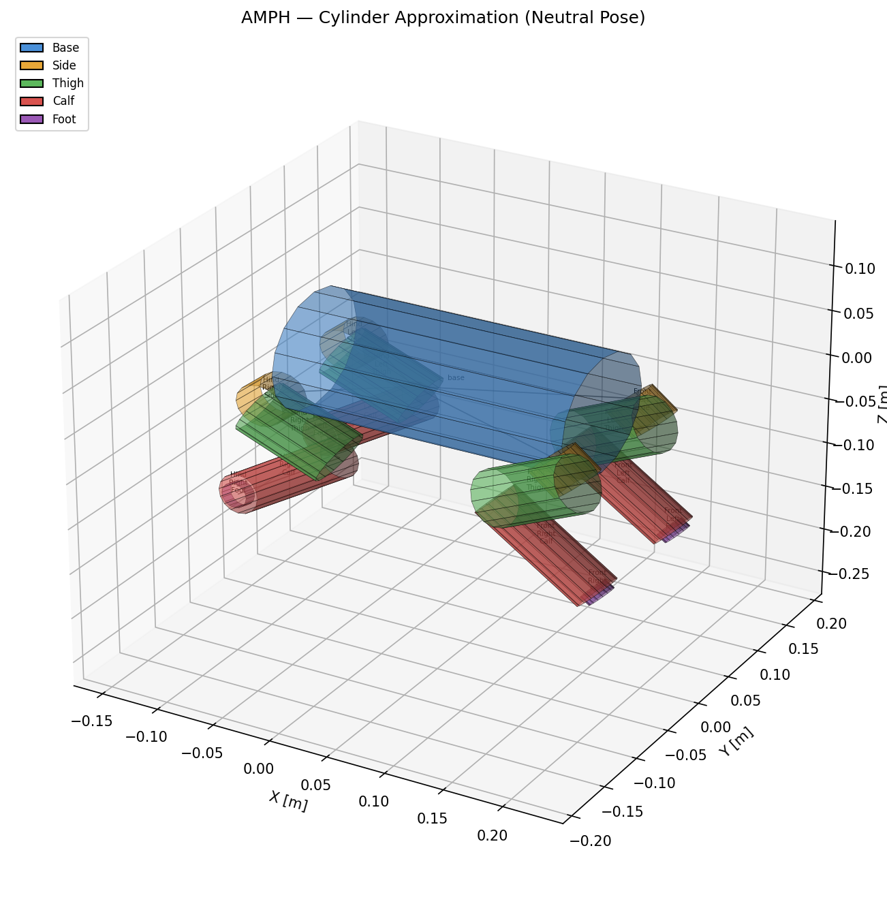
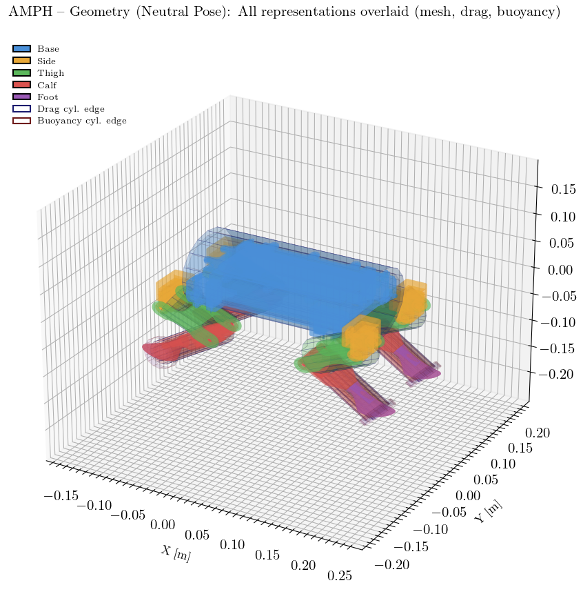
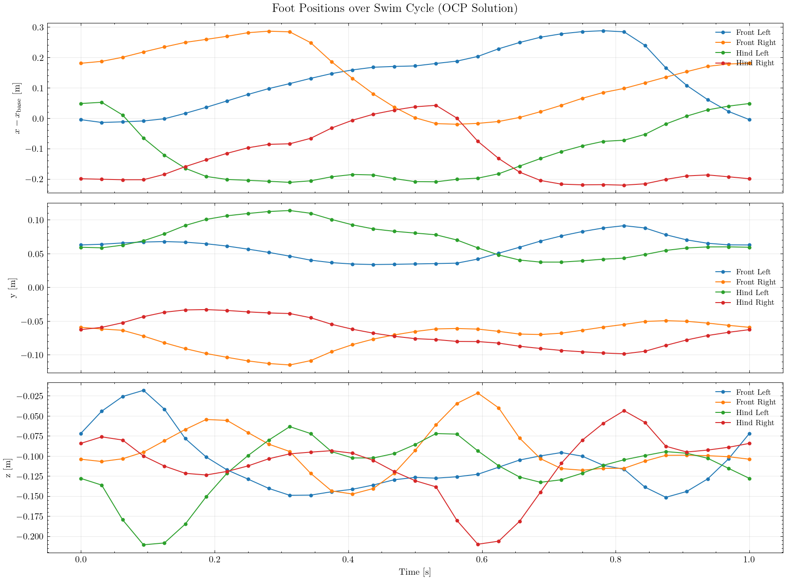
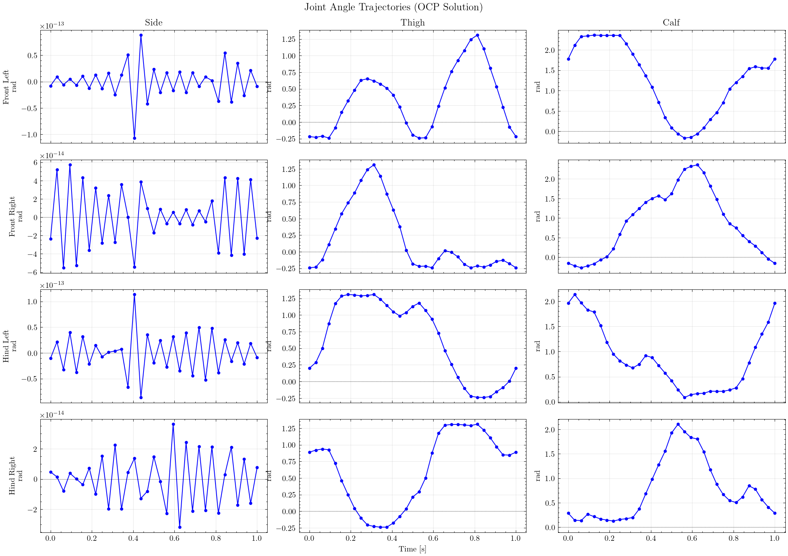
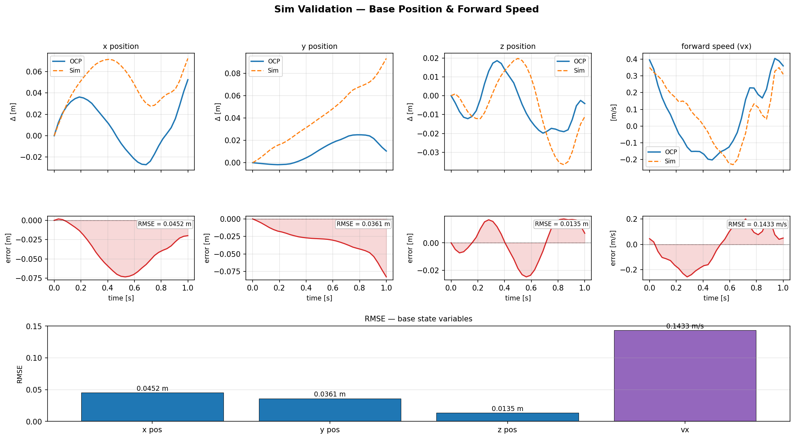

# HydroPEAQ — Hydrodynamic Modeling and Trajectory Optimization for Propulsion Efficiency in Amphibious Quadruped Robots

Energy-efficient **swimming gaits** for amphibious quadruped robots, found by trajectory
optimization against a differentiable hydrodynamic model, co-designed on a
speed-vs-efficiency Pareto front, and validated against a high-fidelity SPH fluid
simulation. The reference platform is the AMPH quadruped; BODY2 is also supported (see
[Multiple robots](#multiple-robots)).

<p align="center">
  
  <br>
  <em>One optimized periodic swim cycle (collocation OCP solution).</em>
</p>

---

## Overview

The robot swims by sweeping its four legs through the water. The goal is to find the
periodic joint trajectory that propels it forward at a target speed while minimizing the
mechanical cost of transport, subject to the full floating-base dynamics plus
hydrodynamic drag, added mass, and buoyancy.

The project is organized as a three-stage pipeline:

| Stage | Folder | What it does |
|-------|--------|--------------|
| **1 — Model & optimize** | [`stage1_gait_optimization/`](stage1_gait_optimization/) | Build the robot + hydrodynamic model and solve the gait optimal-control problem (OCP); co-design gait × cadence into a Pareto front. |
| **2 — Validate** | [`stage2_sim_validation/`](stage2_sim_validation/) | Replay the optimized gait in an SPH fluid simulation (SPlisHSPlasH + Gazebo) and compare against the OCP prediction. |
| **3 — Visualize** | [`stage3_visualization/`](stage3_visualization/) | Plots, thrust heatmaps, and MeshCat 3-D replay of solutions. |

---

## 1 · Modeling & gait optimization

Each rigid link is approximated by a cylinder so drag, added mass, and buoyancy can be
computed symbolically (CasADi) and differentiated through by the optimizer.

<table>
<tr>
<td width="50%"></td>
<td width="50%"></td>
</tr>
<tr>
<td align="center"><em>Cylinder approximation of the robot links.</em></td>
<td align="center"><em>Collision mesh with drag &amp; buoyancy cylinders overlaid.</em></td>
</tr>
</table>

The OCP uses degree-3 Radau **direct collocation** over a periodic cycle with a free
cycle period `T`, minimizing mechanical power subject to an average forward-speed floor.
Two entry points share the same transcription
([`ocp_common.build_collocation_nlp`](stage1_gait_optimization/ocp_common.py)):

- **`trajopt/run_collocation.py`** — solve one gait for the current design.
- **`codesign/run_codesign.py`** — sweep gaits × target speeds into a speed-vs-cost-of-transport Pareto front.

<table>
<tr>
<td width="50%"></td>
<td width="50%"></td>
</tr>
<tr>
<td align="center"><em>Foot trajectories over one cycle (OCP solution).</em></td>
<td align="center"><em>Per-leg joint angles over one cycle.</em></td>
</tr>
</table>

---

## 2 · Simulation validation

The optimized joint trajectory is prescribed to the robot inside an SPH fluid simulation,
and the resulting base motion is compared against the OCP's own prediction — an
independent check that the reduced-order hydrodynamic model used for optimization
actually transfers to a high-fidelity fluid solver.

<p align="center">
  
  <br>
  <em>OCP vs. SPH simulation: base position and forward speed, with per-variable RMSE.</em>
</p>

Per-leg joint-tracking validation figures are also included under
[`docs/figures/`](docs/figures/) (`validation_front_left.png`, `validation_front_right.png`,
`validation_hind_left.png`, `validation_hind_right.png`).

---

## Repository layout

```
.
├── stage1_gait_optimization/     # modeling + gait OCP + co-design
│   ├── hydro_model/              #   robot model + symbolic hydrodynamics (cylinders)
│   ├── initial_guess/            #   warm-start gait builders
│   ├── ocp_common.py             #   shared collocation transcription
│   ├── trajopt/                  #   single-design trajectory optimization
│   │   └── run_collocation.py
│   └── codesign/                 #   speed–efficiency Pareto sweep
│       ├── run_codesign.py
│       └── solver.py
├── stage2_sim_validation/        # SPH (SPlisHSPlasH + Gazebo) validation vs OCP
├── stage3_visualization/         # plots, thrust heatmaps, MeshCat replay
├── splishsplash/                 # SPH fluid simulator + Gazebo plugin
├── src/amph/                     # robot URDF + meshes
└── experiment_results/           # MLflow runs (gitignored)
```

---

## Getting started

Solve a gait and track it with MLflow (see
[`stage1_gait_optimization/README.md`](stage1_gait_optimization/README.md) for the full
workflow, including starting the MLflow server):

```bash
cd stage1_gait_optimization
python trajopt/run_collocation.py     # single-design trajectory optimization
python codesign/run_codesign.py       # speed vs. efficiency Pareto sweep
```

The solvers write the optimized trajectory to `task3_solution.npz`, which stages 2 and 3
consume for simulation and plotting.

> **Note:** `task3_*.npz`, `mlflow.db`, and `mlruns/` are gitignored — they are
> regenerated by the solvers and stored in MLflow rather than committed.

---

## Building and installing the SPlisHSPlasH Gazebo plugin

After making changes to the plugin source, rebuild and install it with:

```bash
cmake --build /home/ws/splishsplash/build --target FluidSimulator -- -j$(nproc)
cmake --install /home/ws/splishsplash/build --prefix /home/moritz/.local
```

The install step copies `libFluidSimulator.so` to `/home/moritz/.local/lib/gazebo-11/plugins/`, which is on `GAZEBO_PLUGIN_PATH` and picked up automatically by Gazebo.
## Multiple robots

The pipeline is parameterised by a `RobotSpec` rather than a hardcoded URDF path.
Registered robots live in `stage1_gait_optimization/hydro_model/robots/`:

| robot   | legs                              | coordinates |
|---------|-----------------------------------|-------------|
| `amph`  | 4 serial legs, 3 joints each      | tree (12 DOF) |
| `body2` | 4 closed-loop planar legs, 2 hip servos each | reduced (8 DOF) |

```bash
python trajopt/run_collocation.py --robot body2
python stage3_visualization/plot_solution.py --solution task3_solution.npz
```

`plot_solution` and `visualize_solution` read the robot from the solution file.
A solved BODY2 gait is committed as `task3_solution_body2.npz` (+0.120 m per
1 s cycle):

```bash
python3 stage3_visualization/plot_solution.py --solution task3_solution_body2.npz
python3 stage3_visualization/visualize_solution.py task3_solution_body2.npz
```

**Adding a robot** means writing one module in `hydro_model/robots/` — naming,
foot points, a declarative `CylinderSpec` per link for the hydro model, and an
`OCPSettings` with that robot's horizon and cost weights — plus, if the robot
has closed kinematic loops, a `CoordinateMap` mapping its actuated coordinates
onto the URDF tree. No pipeline code changes. The OCP weights live on the spec
rather than in `run_collocation.py` so that tuning one robot cannot move
another; `OCPSettings`' defaults are amph's values.

BODY2's loops are handled in reduced coordinates: `body2_map.py` solves the
five-bar and parallelogram in closed form, so the OCP keeps 8 DOF and stays
fully actuated.

### BODY2 in Gazebo

Both robots use the same replay path: `replay_trajectory.py` publishes a
`JointTrajectory` and the model's replay plugin imposes it with
`Joint::SetPosition`. BODY2's loops live in the coordinate map for the OCP and
in the prescription for Gazebo — never in the SDF. All 24 tree joints are
prescribed, not the 8 hips, because an under-constrained tree left to a
position controller comes apart.

Closing the loops with SDF `<joint>` elements and driving the hips through
`ros_control` was tried and is worse: 40° passive-joint RMSE against the
kinematic solution, 54° with ball joints, and the direct LCP solver goes
singular. Don't repeat it.

Because P6 and P8 are not URDF joints, a leg can render with a visible seam.
Measure before believing it means anything — the paddle reaches the base
through a serial chain that no gap at those pins can disturb:

```bash
roslaunch BODY2 joint_prescription.launch \
    npz_path:=/home/ws/task3_solution_body2.npz \
    bag_path:=/home/ws/prescription.bag n_repeat:=3
python3 stage2_sim_validation/check_prescription.py --bag /home/ws/prescription.bag
```

Fed the coordinate map's own output it reads 2.1e-13 mm, so any gap a real run
shows is Gazebo's; one degree of error on a passive joint reads about 1 mm.

> **Resolution caveat.** `particleRadius` is 0.025 in `body2_pool.world`, which
> does not resolve BODY2's legs: the five thin links per leg are bars 4.8–8.2 mm
> across, and they carry 56% of the leg's transverse drag area. At this setting
> the SPH thrust is qualitative. Refine before quoting a number.

The raw SolidWorks export is not directly usable — the base frame sits 1.1 m
from the robot facing backwards, two leg joints are exported as `fixed` when
they are really pins, the four legs are homed at different crank angles, and
the joint names contain dots, which ROS graph names forbid. One script fixes
all of it and refreshes the frozen pin geometry:

```bash
python3 src/BODY2/scripts/prepare_urdf.py     # re-run after every CAD export
```

It is idempotent, so running it on an already-prepared URDF is a no-op.

Tests: `pytest` (fast, ~15 s) or `pytest -m slow` for the end-to-end solves.
`tests/test_amph_regression.py` pins amph's numerics against a golden file so
the multi-robot refactor is provably behaviour-preserving.

</content>
