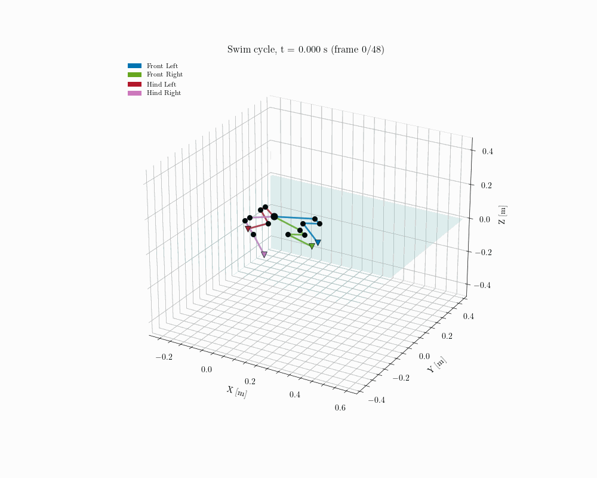
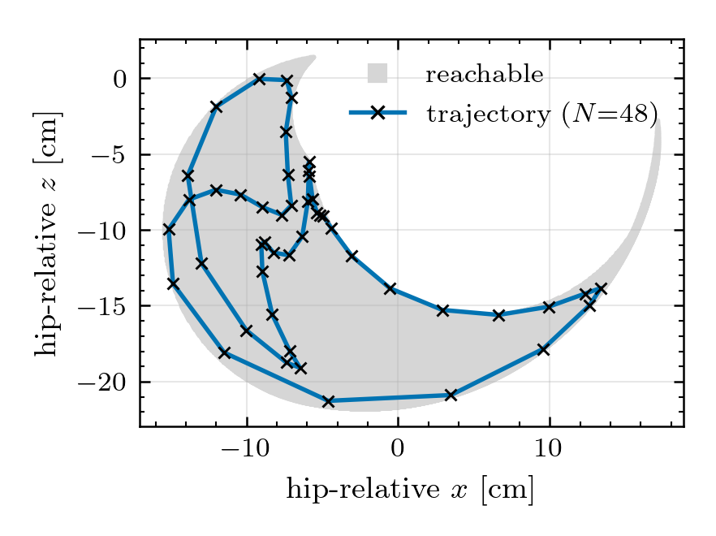
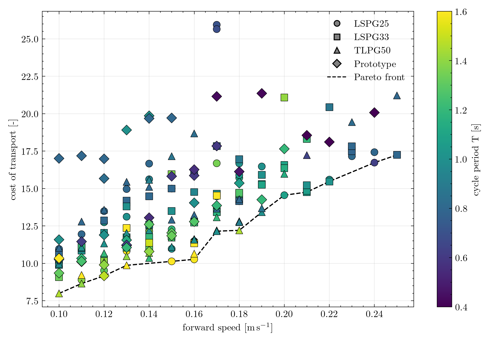

# HydroPEAQ — Hydrodynamic Modeling and Trajectory Optimization for Propulsion Efficiency in Amphibious Quadruped Robots

Energy-efficient **swimming gaits** for amphibious quadruped robots, found by trajectory
optimization against a differentiable hydrodynamic model, co-designed on a
speed-vs-efficiency Pareto front, and validated against a high-fidelity SPH fluid
simulation. The reference platform is the AMPH quadruped; BODY2 is also supported (see
[Multiple robots](#multiple-robots)).

<p align="center">
  
  <br>
  <em>One optimized periodic swim cycle of the nominal gait (TLPG50, 0.18 m/s, T = 1.4 s).</em>
</p>

---

## Overview

The robot swims by sweeping its four legs through the water. The goal is to find the
periodic joint trajectory that propels it forward at a target speed while minimizing the
mechanical cost of transport, subject to the full floating-base dynamics plus
hydrodynamic drag, added mass, and buoyancy. Each link is approximated by a cylinder so
these forces are computed symbolically (CasADi) and differentiated through by the
optimizer.

The project is organized as a three-stage pipeline:

| Stage | Folder | What it does |
|-------|--------|--------------|
| **1 — Model & optimize** | [`stage1_gait_optimization/`](stage1_gait_optimization/) | Build the robot + hydrodynamic model and solve the gait optimal-control problem (OCP); co-design gait × cadence into a Pareto front. |
| **2 — Validate** | [`stage2_sim_validation/`](stage2_sim_validation/) | Calibrate the hydrodynamic coefficients against SPH (SPlisHSPlasH + Gazebo) recordings, replay optimized gaits in the simulator, and test how robust the OCP results are. |
| **3 — Analyze** | [`stage3_visualization/`](stage3_visualization/) | Thesis figures and metrics for solved gaits, the thrust mechanism, and the co-design sweep; MeshCat 3-D replay. |

The OCP uses degree-3 Radau **direct collocation** over a periodic cycle with a free
cycle period `T`, minimizing mechanical power subject to an average forward-speed floor.
Two entry points share the same transcription
([`ocp_common.build_collocation_nlp`](stage1_gait_optimization/ocp_common.py)):

<table>
<tr>
<td width="50%" valign="top"><b><code>trajopt/run_collocation.py</code></b> — solve one gait for the current design.</td>
<td width="50%" valign="top"><b><code>codesign/run_codesign.py</code></b> — sweep initial gaits × target speeds × cycle periods into a speed-vs-cost-of-transport Pareto front.</td>
</tr>
<tr>
<td></td>
<td></td>
</tr>
<tr>
<td align="center"><em>Hind-left foot path of the nominal solved gait (TLPG50, 0.18 m/s) inside the leg's reachable workspace at its joint limits.</em></td>
<td align="center"><em>Co-design sweep: every feasible solve by initial gait (marker) and cycle period (colour), with the Pareto front dashed.</em></td>
</tr>
</table>

---

## Repository layout

```
.
├── stage1_gait_optimization/     # modeling + gait OCP + co-design
│   ├── hydro_model/              #   robot model + symbolic hydrodynamics (cylinders)
│   │   └── robots/               #   one RobotSpec per robot (amph, body2)
│   ├── initial_guess/            #   warm-start gait builders
│   ├── ocp_common.py             #   shared collocation transcription
│   ├── trajopt/                  #   single-design trajectory optimization
│   │   └── run_collocation.py
│   └── codesign/                 #   speed–efficiency Pareto sweep
│       ├── run_codesign.py
│       └── solver.py
├── stage2_sim_validation/        # SPH (SPlisHSPlasH + Gazebo) validation vs OCP
│   ├── hydro_calibration/        #   fit the hydro coefficients to recordings
│   ├── model_checks/             #   symbolic-model sanity checks, no recording
│   ├── gazebo_replay/            #   simulator vs OCP comparison figures
│   └── sensitivity_and_robustness/  # mesh, multistart, coefficient studies
├── stage3_visualization/         # thesis figures, metrics, MeshCat replay
│   ├── common/                   #   shared helpers + thesis plot style
│   ├── metrics/                  #   scripts that print the thesis numbers
│   ├── gait/                     #   one solved gait: solution, base motion, limits
│   ├── thrust/                   #   how the stroke makes thrust
│   ├── speed_sweep/              #   trends across the co-design sweep
│   └── model/                    #   SPH boundary-particle figure
├── src/                          # ROS packages: amph, BODY2 (URDF + meshes), sph_replay
├── splishsplash/                 # SPH fluid simulator + Gazebo plugin
├── tests/                        # pytest suite
├── docs/figures/                 # figures used in this README
└── experiment_results/           # MLflow tracking DB + artifacts (gitignored)
```

---

## Getting started

All commands run from the repository root.

**1. Start the MLflow server.** `run_collocation.py` logs every solve to it and fails
without it. Start it from `experiment_results/`, so the database and artifact store are
created there:

```bash
cd experiment_results
mlflow server --host 0.0.0.0 --port 5000 \
              --backend-store-uri sqlite:///mlflow.db \
              --default-artifact-root ./mlruns &
cd ..
```

Runs are then browsable at **http://localhost:5000** (see
[`stage1_gait_optimization/README.md`](stage1_gait_optimization/README.md) for stopping
the server and cleaning up deleted runs).

**2. Solve a gait, or sweep the design space:**

```bash
python stage1_gait_optimization/trajopt/run_collocation.py            # one gait (default --robot amph)
python stage1_gait_optimization/codesign/run_codesign.py              # speed vs. efficiency Pareto sweep
```

`run_collocation.py` writes `task3_guess.npz` and `task3_solution.npz` to the current
directory and logs both to the MLflow experiment `gait_ocp`; the stage 3 scripts read
`task3_solution.npz` from the repository root by default. `run_codesign.py` writes one
solution per point, `codesign_summary.json`, and `pareto_front.{png,pdf}` to
`stage1_gait_optimization/codesign/codesign_results/` and logs the sweep to the
experiment `gait_codesign`. The sweep grid and parallelism are set at the top of
`run_codesign.py`.

**3. Look at the result:**

```bash
python stage3_visualization/gait/plot_solution.py                     # task3_solution.npz
python stage3_visualization/gait/visualize_solution.py task3_solution.npz   # MeshCat replay
python stage3_visualization/thrust/hind_workspace.py --solution task3_solution.npz --leg Hind_Left
```

> **Note:** root-level `*.npz` files, `mlflow.db`, `mlruns/`, and `codesign_results/` are
> gitignored — they are regenerated by the solvers and stored in MLflow rather than
> committed.

---

## Building and installing the SPlisHSPlasH Gazebo plugin

After making changes to the plugin source, rebuild and install it with:

```bash
cmake --build /home/ws/splishsplash/build --target FluidSimulator -- -j$(nproc)
cmake --install /home/ws/splishsplash/build --prefix /home/moritz/.local
```

The install step copies `libFluidSimulator.so` to `/home/moritz/.local/lib/gazebo-11/plugins/`, which is on `GAZEBO_PLUGIN_PATH` and picked up automatically by Gazebo.

## Multiple robots

The pipeline is parameterised by a `RobotSpec` rather than a hardcoded URDF path.
Registered robots live in `stage1_gait_optimization/hydro_model/robots/`:

| robot   | legs                              | coordinates |
|---------|-----------------------------------|-------------|
| `amph`  | 4 serial legs, 3 joints each      | tree (12 DOF) |
| `body2` | 4 closed-loop planar legs, 2 hip servos each | reduced (8 DOF) |

```bash
python stage1_gait_optimization/trajopt/run_collocation.py --robot body2
python stage3_visualization/gait/plot_solution.py --solution task3_solution.npz
python stage3_visualization/gait/visualize_solution.py task3_solution.npz
```

`plot_solution` and `visualize_solution` read the robot from the solution file.

**Adding a robot** means writing one module in `hydro_model/robots/` — naming,
foot points, a declarative `CylinderSpec` per link for the hydro model, and an
`OCPSettings` with that robot's horizon and cost weights — plus, if the robot
has closed kinematic loops, a `CoordinateMap` mapping its actuated coordinates
onto the URDF tree. No pipeline code changes. The OCP weights live on the spec
rather than in `run_collocation.py` so that tuning one robot cannot move
another; `OCPSettings`' defaults are amph's values.

BODY2's loops are handled in reduced coordinates: `body2_map.py` solves the
five-bar and parallelogram in closed form, so the OCP keeps 8 DOF and stays
fully actuated.

### BODY2 in Gazebo

Both robots use the same replay path: `replay_trajectory.py` publishes a
`JointTrajectory` and the model's replay plugin imposes it with
`Joint::SetPosition`. BODY2's loops live in the coordinate map for the OCP and
in the prescription for Gazebo — never in the SDF. All 24 tree joints are
prescribed, not the 8 hips, because an under-constrained tree left to a
position controller comes apart.

Closing the loops with SDF `<joint>` elements and driving the hips through
`ros_control` was tried and is worse: 40° passive-joint RMSE against the
kinematic solution, 54° with ball joints, and the direct LCP solver goes
singular. Don't repeat it.

Because P6 and P8 are not URDF joints, a leg can render with a visible seam.
It does not move the paddle, which reaches the base through a serial chain that
no gap at those pins can disturb.

> **Resolution caveat.** `particleRadius` is 0.025 in `body2_pool.world`, which
> does not resolve BODY2's legs: the five thin links per leg are bars 4.8–8.2 mm
> across, and they carry 56% of the leg's transverse drag area. At this setting
> the SPH thrust is qualitative. Refine before quoting a number.

The raw SolidWorks export is not directly usable — the base frame sits 1.1 m
from the robot facing backwards, two leg joints are exported as `fixed` when
they are really pins, the four legs are homed at different crank angles, and
the joint names contain dots, which ROS graph names forbid. One script fixes
all of it and refreshes the frozen pin geometry:

```bash
python3 src/BODY2/scripts/prepare_urdf.py     # re-run after every CAD export
```

It is idempotent, so running it on an already-prepared URDF is a no-op.
